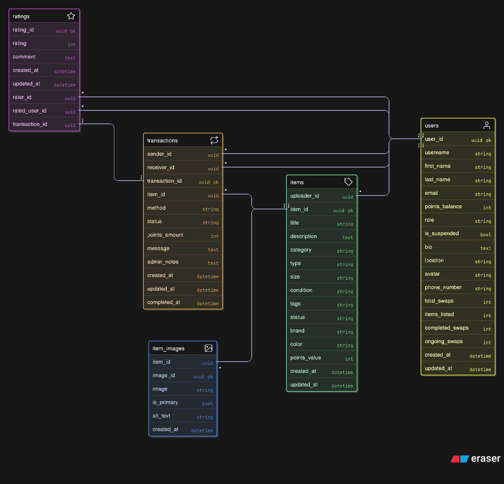

# ReWear – Community Clothing Exchange

## Problem Statement 3: Sustainable Fashion Platform

### Overview
Develop **ReWear**, a web-based platform that enables users to exchange unused clothing through direct swaps or a point-based redemption system. The goal is to promote sustainable fashion and reduce textile waste by encouraging users to reuse wearable garments instead of discarding them.

---

## 🎯 Project Features

### 🔐 User Authentication
- Email/password signup and login
- Secure user session management

### 🏠 Landing Page
- Platform introduction and mission
- Calls-to-action: "Start Swapping", "Browse Items", "List an Item"
- Featured items carousel
- Sustainable fashion impact statistics

### 📊 User Dashboard
- Profile details and points balance
- Uploaded items overview
- Ongoing and completed swaps list
- Transaction history

### 👕 Item Detail Page
- Image gallery and full item description
- Uploader information and ratings
- Options: "Swap Request" or "Redeem via Points"
- Item availability status
- Similar items suggestions

### ➕ Add New Item Page
- Upload multiple images
- Enter comprehensive details:
  - Title and description
  - Category (tops, bottoms, outerwear, etc.)
  - Type (casual, formal, sportwear, etc.)
  - Size (XS-XXL, numerical sizes)
  - Condition (new, like new, good, fair)
  - Tags for better discoverability
- Submit to list item for approval

### 👨‍💼 Admin Role
- Moderate and approve/reject item listings
- Remove inappropriate or spam items
- User management and suspension capabilities
- Lightweight admin panel for platform oversight
- Analytics and reporting dashboard

---

## 🏗️ Technical Architecture

### Database Schema (ERD)


The database consists of 5 core entities:
- **User**: Extended Django user model with profile information, points balance, and platform statistics
- **Item**: Clothing items with detailed categorization, condition, and metadata
- **ItemImage**: Multiple images per item with primary image designation
- **Transaction**: Swap requests, purchases, and transaction status tracking
- **Rating**: User rating and review system for trust building

### Backend (Django + PostgreSQL)
- **Framework**: Django 5.1.5 with Django REST Framework
- **Database**: PostgreSQL for robust data management
- **Authentication**: Django's built-in auth with JWT tokens
- **File Storage**: Media handling for item images
- **API**: RESTful endpoints for frontend communication

### Frontend (Next.js + TypeScript + Tailwind CSS)
- **Framework**: Next.js 15 with App Router
- **Language**: TypeScript for type safety
- **Styling**: Tailwind CSS for responsive design
- **State Management**: React hooks and context
- **API Integration**: Axios for HTTP requests

### API Documentation & Testing
- **Comprehensive API Tests**: 27 Postman test cases covering all endpoints
- **Test Categories**: Authentication, User Management, Item Management, Transactions, Ratings, Error Handling
- **Files**: 
  - `backend/ReWear_API_Complete_Tests.postman_collection.json`
  - `backend/ReWear_API_Environment.postman_environment.json`
  - `backend/API_Testing_Guide.md`
- **Live API**: [Production API Endpoint](https://rewear-community-clothing-exchange-production.up.railway.app/api/)

---

## 🚀 Getting Started

### Prerequisites
- Python 3.8+
- Node.js 18+
- PostgreSQL
- Git

### Backend Setup
```bash
cd backend
python -m venv .venv
.venv\Scripts\activate  # Windows
pip install -r requirements.txt
# Configure .env file with database credentials
python manage.py setup_db
python manage.py runserver
```

### Frontend Setup
```bash
cd frontend
npm install
npm run dev
```

### Quick Start
- **Production Backend**: `https://rewear-community-clothing-exchange-production.up.railway.app`
- **Production API**: `https://rewear-community-clothing-exchange-production.up.railway.app/api/`
- **Local Backend**: `http://localhost:8000`
- **Local Frontend**: `http://localhost:3000`
- **Admin Panel**: `http://localhost:8000/admin` (admin/admin123 or venkatesh/venkat*2005)

---

## 🌍 Impact & Sustainability

ReWear addresses the growing concern of textile waste by:
- **Reducing Waste**: Extending the lifecycle of clothing items
- **Community Building**: Connecting environmentally conscious users
- **Affordable Fashion**: Making quality clothing accessible through swaps
- **Awareness**: Promoting sustainable fashion practices

---

## 📁 Project Structure

```
Odoo-hackathon/
├── backend/                 # Django REST API
│   ├── config/             # Project settings
│   ├── apps/               # Django applications
│   │   ├── core/          # Core functionality
│   │   ├── users/         # User management
│   │   ├── items/         # Clothing items
│   │   └── swaps/         # Swap transactions
│   └── requirements.txt
├── frontend/               # Next.js frontend
│   ├── src/
│   │   ├── app/           # App router pages
│   │   ├── components/    # Reusable components
│   │   └── lib/          # Utilities and config
│   └── package.json
└── README.md              # This file
```

---

## 🛠️ Development Status

- ✅ Backend Django setup with PostgreSQL
- ✅ Frontend Next.js setup with TypeScript & Tailwind
- ✅ Complete API endpoints development (27 endpoints)
- ✅ Comprehensive API testing with Postman (27 test cases)
- ✅ Database schema design and ERD
- ✅ User authentication system with JWT
- ✅ Item management features (CRUD, image upload, filtering)
- ✅ Swap/transaction mechanism with points system
- ✅ Rating and review system
- ✅ Admin panel with Django admin
- ✅ Production deployment on Railway
- 🔄 User interface implementation
- 🔄 Frontend-backend integration
- 🔄 UI/UX refinements

---

## 🤝 Contributing

This project is part of the Odoo Hackathon. Follow the development guidelines and contribute to building a sustainable fashion platform.

## 📄 License

This project is developed for the Odoo Hackathon and follows the hackathon's terms and conditions.